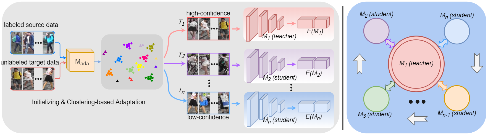
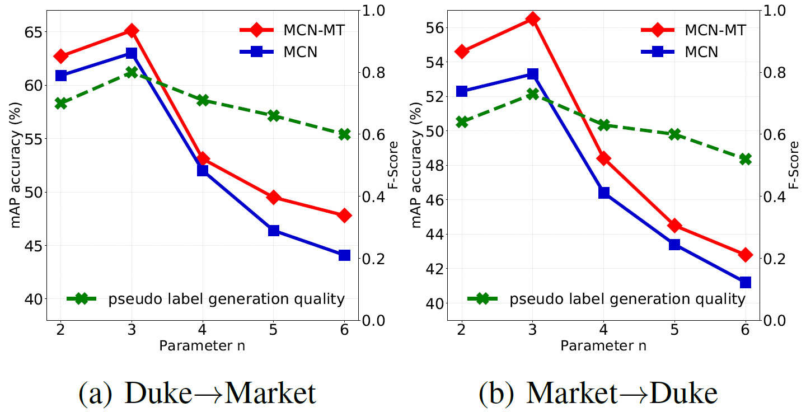

# MCN-MT

## Learning From Self-Discrepancy via Multiple Co-Teaching for Cross-Domain Person Re-Identification (MCN-MT)



This is the official implementation of MCN-MT in PyTorch framework, and our paper is submitted to ICASSP 2021, and it is still under view. 

### News
- Support Market1501, DukeMTMC-reID and CUHK03 datasets.
- The current version supports training on multi-GPUs.


### TODO
Write the documents.

### Requirements
- Python3
- Numpy==1.16.4
- Matplotlib==3.1.1
- Torch==1.3.1
- Metric_learn==0.4.0
- tqdm==4.32.2
- torchvision==0.2.0
- scipy==1.1.0
- h5py==2.9.0
- Pillow==6.2.1
- six==1.13.0
- scikit_learn==0.21.3

### How to use it?
This repo. supports training on multiple GPUs and the default setting is also multi-GPU.

1. Download all necessry datasets, e.g. DukeMTMC-reID, Market-1501 and CUHK03 datasets and move them to 'data'.  

2. Before performing training from scratch, please download all models ([Baidu NetDisk](https://pan.baidu.com/s/1WcjIyvoW8RI-FrEdsnLVgg), Password: 102s) pretrained on DukeMTMC-reID and Market-1501, and then move them in the 'MCN_pretrain'

3. If you want to restart the train process using MCN with 3 models when trained on DukeMTMC-reID, while tested on Market-1501, the command you can type as
```
CUDA_VISIBLE_DEVICES=0,1,2,3 python selftrainingACT_3model.py --src_dataset dukemtmc --tgt_dataset market1501 --resume ./MCN_pretrain/Duke/Duke2Market.pth --data_dir ./data --logs_dir ./logs/dukemar_3model
```

If you want to restart the train process using MCN-MT (with meannet) with 3 models when trained on DukeMTMC-reID, while tested on Market-1501, the command you can type as
```
CUDA_VISIBLE_DEVICES=0,1,2,3 python selftrainingACT_3model_meannet.py --src_dataset dukemtmc --tgt_dataset market1501 --resume ./MCN_pretrain/Duke/Duke2Market.pth --data_dir ./data --logs_dir ./logs/dukemar_3model_meannet
```

If you want to train your own's pretrained model, please train source and adapted model by using code in [Adaptive-ReID](https://github.com/LcDog/DomainAdaptiveReID) and follow Step#2.

### Experiment Results on DukeMTMC-reID and Market-1501 datasets.
<!-- markdownlint-disable MD033 -->
<table>
    <tr>
        <th rowspan="2">Source --&gt; Target</th>
        <th colspan="2">MCN</th>
        <th colspan="2">MCN-MT</th>
        <th rowspan="2">Settings</th>
    </tr>
    <tr>
        <td>Rank-1</td>
        <td>mAP</td>
        <td>Rank-1</td>
        <td>mAP</td>
    </tr>
    <tr><td>Duke --&gt; Market</td><td>82.6</td><td>63.2</td><td>84.3</td><td>64.9</td><td>4GPUs</td></tr>
    <tr><td>Market --&gt; Duke</td><td>72.5</td><td>53.5</td><td>74.7</td><td>57.8</td><td>4GPUs</td></tr>
    <tr><td>CUHK03 --&gt; Market</td><td>82.2</td><td>66.1</td><td>84.8</td><td>68.7</td><td>4GPUs</td></tr>
    <tr><td>CUHK03 --&gt; Duke</td><td>53.3</td><td>37.2</td><td>56.3</td><td>40.2</td><td>4GPUs</td></tr>
</table>

### Experiment results on Impact of branch numbers n.


### Acknowledgments
This work was supported by the National Natural Science Foundation of China under Project(Grant No.61977045).
If you have further questions and suggestions, please feel free to contact us (xiangsuncheng17@sjtu.edu.cn).